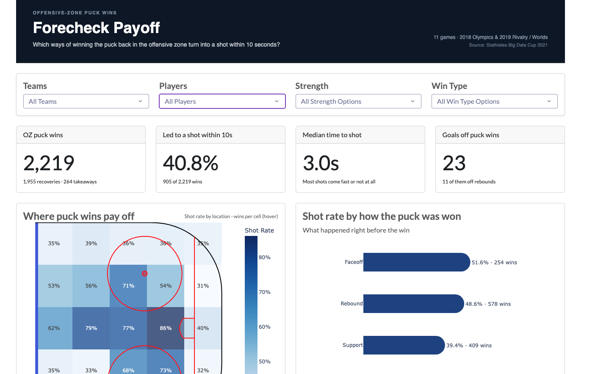

# Forecheck Payoff

Shot rates off offensive-zone puck wins in the Stathletes Big Data Cup women's games.

Live site: https://cf-forecheck-payoff.onrender.com/



## The question

Which ways of winning the puck back in the offensive zone turn into a shot within 10 seconds, and where on the ice?

A forecheck pays off when the puck you win in the offensive zone turns into a shot. Splitting those wins by what happened just before shows which kind of pressure gets a shot. The map shows where on the ice that happens, so you can compare the middle of the ice with the boards.

The data is the Big Data Cup 2021 event file from Stathletes. NCAA games are removed. What remains is 11 games, 11 February 2018 to 14 April 2019. The app header calls them the 2018 Olympics and the 2019 Rivalry / Worlds. Four teams: Canada, the United States, Finland, and Olympic Athletes from Russia.

## Findings

All figures below are from `warehouse.fact_puck_wins`, with no filters. Rates and shares are rounded to one decimal, so the shares can add to 100.1.

There were 2,219 offensive-zone puck wins: 1,955 puck recoveries and 264 takeaways. 905 of them became a shot within 10 seconds, a 40.8% shot rate. The median time from the win to that shot was 3 seconds. Those sequences produced 23 goals, 11 of them off rebounds.

Shot rate by how the puck was won:

| Win type            | Wins | Shot rate |
| ------------------- | ---: | --------: |
| Faceoff             |  254 |     51.6% |
| Rebound             |  578 |     48.6% |
| Support             |  409 |     39.4% |
| Forced Turnover     |  866 |     34.3% |
| Forecheck Retrieval |  112 |     31.3% |

Faceoffs became a shot most often. Forecheck retrievals became a shot least often. Forced turnovers were the most common win. A period change would be labeled Other / Loose Puck. None of these wins were.

The rink is split into 15 by 17 foot cells. The highest shot rate is the middle of the ice, closer to the end of the zone than to the blue line (x 170 to 185, y 34 to 51): 86.2% on 65 wins. The lowest is the same x band, along one side boards (x 170 to 185, y 0 to 17): 30.4% on 158 wins. In this file x runs from 125 (offensive zone starts here) to 200, and y runs from 0 to 85, one boards to the other.

Highest shot rates among players with at least 20 wins:

- Ann-Sophie Bettez, Canada: 54.3% (19 of 35)
- Natalie Spooner, Canada: 50.0% (38 of 76)
- Brigette Lacquette, Canada: 50.0% (24 of 48)
- Amanda Kessel, United States: 47.2% (25 of 53)
- Hilary Knight, United States: 46.8% (29 of 62)

How the 10 seconds ended:

| What happened                | Wins | Share |
| ---------------------------- | ---: | ----: |
| Opponent got the puck back   |  911 | 41.1% |
| Shot                         |  905 | 40.8% |
| Still had it, no shot        |  357 | 16.1% |
| Whistle (faceoff or penalty) |   46 |  2.1% |

## Data engineering

`pipeline/pipeline.py` runs one Python file per layer, in order:

raw CSV, `staging.events`, `clean.events`, then the warehouse star schema.

| Table                      | Grain                                                  |   Rows |
| -------------------------- | ------------------------------------------------------ | -----: |
| `staging.events`           | One raw event, plus an `event_id` for file order       | 24,002 |
| `clean.events`             | One Olympic event after exact duplicates are removed   | 20,520 |
| `warehouse.dim_team`       | One team                                               |      4 |
| `warehouse.dim_player`     | One player on one team                                 |    117 |
| `warehouse.dim_game`       | One game                                               |     11 |
| `warehouse.fact_events`    | One clean event, with keys to game, teams, and players | 20,520 |
| `warehouse.fact_puck_wins` | One offensive-zone puck recovery or takeaway           |  2,219 |

Cleaning choices:

- `Clock` is read as text. DuckDB was detecting it as a time of day.
- NCAA rows are dropped (3,481 of the 24,002 staged events). Team names lose the `Olympic (Women) - ` prefix. Player, event, clock, and detail text is trimmed.
- One exact duplicate row is removed (20,521 Olympic events down to 20,520), ignoring `event_id`.
- `game_id` is a rank of game date plus the two teams.
- Strength comes from skater counts: extra attacker (EA) if that team has 6, empty net (EN) if the opponent has 6, power play (PP) if they have more skaters, penalty kill (PK) if they have fewer, otherwise even strength (EV).
- Zone comes from the x coordinate: offensive zone at x >= 125, defensive zone at x <= 75, neutral zone in between. Coordinates stay in the event team's view, so each team's offensive zone is the high-x end.

`dim_player` includes `player_2`. On a faceoff win, a penalty taken, or a zone entry, that player is assigned to the opponent. On other events, `player_2` stays with the event team.

## Research

A puck win is a `Puck Recovery` or a `Takeaway` in the offensive zone.

Win type comes from the previous event in the same game:

- Previous event was in another period: Other / Loose Puck.
- Previous event was a shot by the same team: Rebound.
- Previous event was a faceoff win by the same team: Faceoff.
- Previous event was a dump in or out by the same team, or a zone entry marked dumped by the same team: Forecheck Retrieval.
- The win itself is a takeaway, or the previous event belonged to the opponent: Forced Turnover.
- Anything else: Support.

The first matching rule wins.

The 10 second window looks forward in the same game and the same period only, up to 10 seconds of game time. It can end sooner. The first later event by the other team, or a faceoff win, or a penalty, closes the window. A shot counts only if it is by the same team and its event comes before that closing event. A shot is a `Shot` or a `Goal`.

`end_reason` is `shot` when that shot counts. If the window instead ends on a faceoff or a penalty, it is `stoppage`. If it ends on another opponent event, it is `opponent_possession`. If nothing ends it, it is `time_expired`.

Ten seconds is long enough for a shot off the recovery and short enough that a later shot is a new play. The file does not label how the puck was won, so the type is taken from the event just before. Only the offensive zone is included, because the question is the payoff of pressure that is already in the attacking zone.

## Interface

The app is Dash with dash-bootstrap-components. Queries live in `app/queries.py`. The rink is drawn with rink_plotly.

Filters are team, player, strength, and win type. Choosing a team narrows the player list to that team. The four filters are applied together on the cards, the rink, the player table, and the end-reason chart. The win-type bar chart does not take the win-type filter. It always shows every type and highlights the one you selected.

- Cards: offensive-zone wins (recoveries and takeaways), shot rate within 10 seconds, median seconds to the shot, and goals (rebound goals underneath).
- Rink: shot rate in 15 by 17 foot cells. The color scale is fixed from 30% to 90%.
- Win-type bars: shot rate for each way the puck was won. The selected type stays blue. The others go gray.
- Player table: players with at least 20 wins. The minimum drops to 5 when a strength or win type is selected, and to 1 when a single player is selected.
- End-reason chart: how the 10 seconds finished (shot, opponent possession, time expired, whistle).

## Design choices

- DuckDB and a star schema, so the app can filter facts with SQL and no separate database server.
- One Python file per layer, instead of standalone SQL files, so `pipeline.py` can run the steps in order.
- Dash, so the interface stays in Python with the pipeline.
- rink_plotly, so the rates sit on an offensive-zone rink.
- The heat map stays up for a single player, so the page does not change shape when the filters change.
- The color scale is fixed from 30% to 90%, so a dark cell means the same rate after you change a filter.

## Challenges

- Choosing the appropriate UI tool given the time frame. I chose Dash because the learning curve was small and I could get a complete site live fast.
- Picking the focus. I hadn't done a forecheck analysis in my other projects and felt like this was a good time to go down that road.
- Getting the puck win logic right. I split it into 6 CTEs that got the previous events, the wins, the 10-second window, the event that ends the window, the first shot, and the outcome.
- DuckDB read the Clock column as time of day, which broke the time math. I forced it to text and converted it to seconds myself.

## Limitations

- Small sample: 11 games and 4 teams.
- Women's games from the Olympic file only. NCAA games in the source file are excluded.
- No tracking data. The file is logged events, not player paths.
- The 10 second window is a choice. A different cutoff would move wins between shot and time expired.
- Event coordinates are recorded by hand.

## Run locally

```bash
python -m venv .venv
source .venv/bin/activate
pip install -r requirements.txt
python -m pipeline.pipeline
python -m app.app
```

Dash prints a local URL when it starts.

Dev tests:

```bash
pip install -r requirements-dev.txt
python -m pytest
```

Deployed on Render. Build command: `pip install -r requirements.txt && python -m pipeline.pipeline`. Start command: `gunicorn app.app:server`.

## Tests

`tests/test_pipeline.py` checks the warehouse itself.

- `clean.events` has 20,520 rows, no full duplicate rows, and period time inside 0 to 1,200 seconds.
- `fact_events` has the same number of rows as `clean.events`, and the game, team, and player keys are filled in.
- 11 games, 4 teams, and one row per player and team.
- 2,219 puck wins, one row per event, offensive zone only, recoveries or takeaways, and a known win type.
- A win marked as leading to a shot has a shot inside 10 seconds. The others do not keep a shot id.
- `end_reason` is one of the four labels, and `shot` matches `led_to_shot` in both directions.
- The overall shot rate rounds to 0.408.

`tests/test_queries.py` checks the functions the app calls.

- The unfiltered summary matches the totals above. A team filter counts only that team. A player who is not on that team returns 0 wins.
- For the same filters, rink cells, win-type rows, and end-reason totals add up to the summary. The shot end reason matches the summary's shot count.
- Win types and end reasons stay inside the allowed lists. Filtering the summary to one win type matches that type's bar.
- The player table keeps players with at least 20 wins, uses 5 when a win type is selected, and still returns a player with fewer than 20 when that player is selected.

`python -m pytest`: 95 passed, 4 skipped. The skips are filter sets that include win type, on the check that compares the bar chart to the summary. That chart does not take a win-type filter.

## Project structure

```
pipeline/config.py                              CSV and DuckDB paths
pipeline/pipeline.py                            Runs every build step in order
pipeline/setup_warehouse.py                     Creates the staging, clean, and warehouse schemas
pipeline/build_staging.py                       Loads the raw CSV
pipeline/build_clean.py                         Cleans events
pipeline/build_dims.py                          Team, player, and game dimensions
pipeline/build_facts.py                         fact_events
pipeline/build_puck_wins.py                     fact_puck_wins, including win type and the 10 second window
app/app.py                                      Dash layout and callbacks
app/queries.py                                  DuckDB queries used by the app
app/components/rink.py                          Offensive-zone rink and heat map
tests/conftest.py                               One read-only connection for the tests
tests/test_pipeline.py                          Warehouse checks
tests/test_queries.py                           App query checks
data/raw/olympic_womens_dataset.csv
data/flames_data_challenge_warehouse.duckdb     Built by the pipeline, not committed
requirements.txt                                App and pipeline packages
requirements-dev.txt                            pytest, fg-data-profiling (profiling notebook)
notebooks/                                      Profiling notes. The app does not use them.
docs/Forecheck_Payoff.png                       Screenshot of the application.
```
